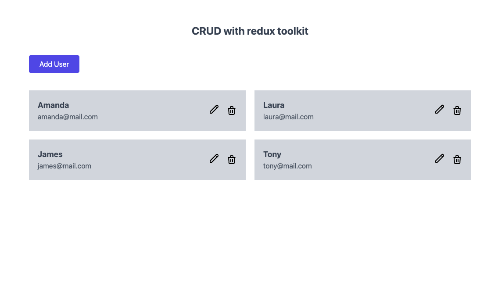

# CRUD App [visit my site](https://priyaganga-crud-app.netlify.app/)
It is a CRUD (Create, Read, Update, Delete) application built using React.js and Redux Toolkit for state management. Here's a breakdown of the different parts:

# Technologies Used:
+ React: A JavaScript library for building user interfaces, used for creating components and managing the UI.
+ Redux Toolkit: A package that simplifies Redux usage by providing utilities for writing Redux logic in a more efficient way.
+ React Router Dom: Library for routing within a React application.
+ UUID: A package for generating unique IDs.
+ Tailwind CSS: A utility-first CSS framework used for styling the application.

# Project Structure:
Redux Store Configuration: The store.js file configures the Redux store using configureStore from Redux Toolkit. It combines reducers, in this case, the usersReducer, to create the application's store.

# Reducers and Actions:
userSlice.js defines a Redux slice named users with actions like addUser, editUser, and deleteUser to manipulate user data in the Redux store.
Each action modifies the users state in response to different user interactions like adding, editing, or deleting users.

# Components:
+ Button Component: A reusable button component styled with Tailwind CSS used across the app.
+ TextField Component: A reusable input field component for forms.

# Pages:
App Component: The main entry point of the application. It sets up routing using react-router-dom and provides navigation to different pages like AddUser, EditUser, and UserList.

+ AddUser Component: Contains a form for adding a new user. It dispatches an action to add a user to the Redux store.
+ EditUser Component: Allows editing existing user details fetched from the Redux store based on the user ID passed through the URL. It 
  dispatches an action to edit user details.
+ UserList Component: Renders a list of users fetched from the Redux store. It provides options to edit or delete users.

# Project Flow:
Routing: The application uses React Router Dom (BrowserRouter and Routes) to manage different views like adding users, editing user details, and displaying the user list.

# Redux Integration:
Redux is used to manage the application's state, specifically for user-related data. The usersReducer handles actions related to users.

# UI Components: 
Components like buttons, text fields, and cards are utilized for a consistent and reusable UI.

# User Interaction: 
Users can add, edit, and delete user entries through appropriate forms and actions triggered by user events (like button clicks).

# Styling: 
Tailwind CSS classes are applied for styling, ensuring a responsive and clean UI.

In summary, this project is a React-based CRUD application using Redux Toolkit for state management, React Router Dom for navigation, and Tailwind CSS for styling. It allows users to perform CRUD operations on a list of users stored in the Redux store.

This project was bootstrapped with [Create React App](https://github.com/facebook/create-react-app).

## Available Scripts

In the project directory, you can run:

### `yarn install`

Instal All dependencies in this project

### `yarn start`

Runs the app in the development mode. 
Open [http://localhost:3000](http://localhost:3000) to view it in the browser.

### Link

Reactjs: https://reactjs.org/docs/create-a-new-react-app.html
TailwindCSS: https://tailwindcss.com/
Redux Toolkit: https://redux-toolkit.js.org/tutorials/quick-start
Hero Icon: https://heroicons.com/
ReactRouter: https://reactrouter.com/
UUID: https://www.npmjs.com/package/uuid?activeTab=readme

